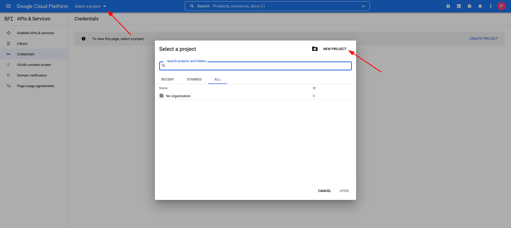
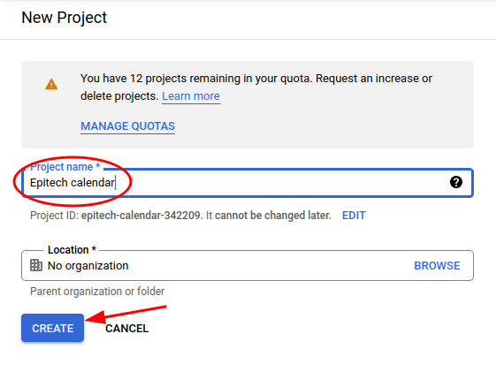
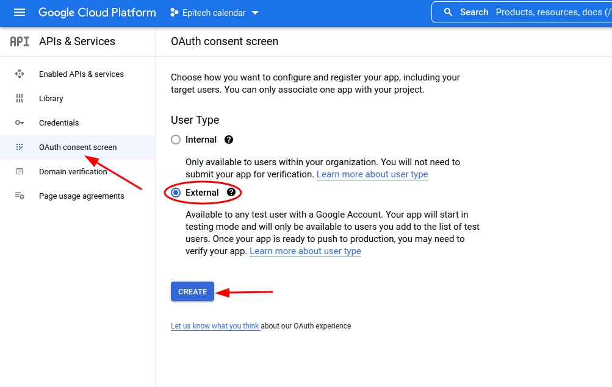
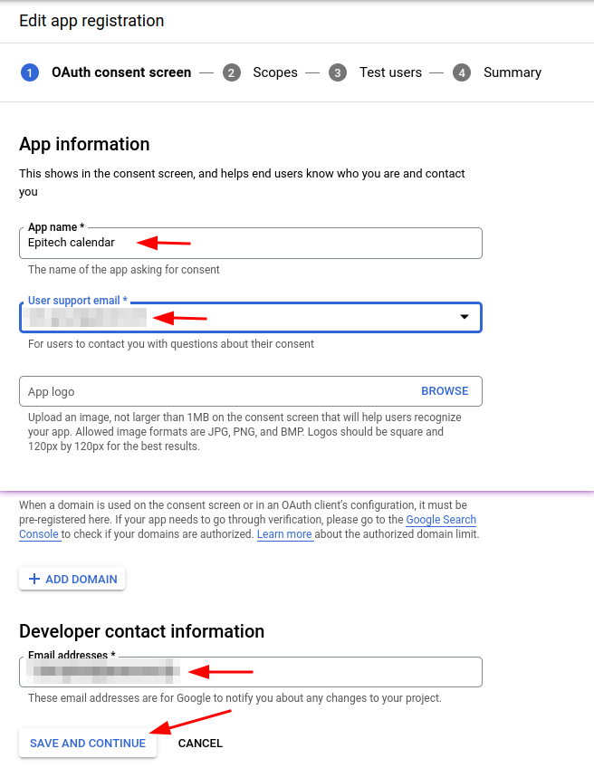
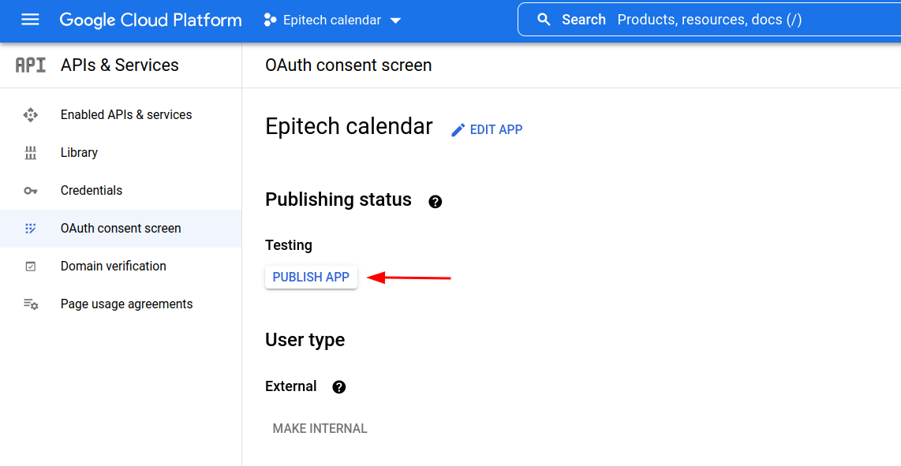
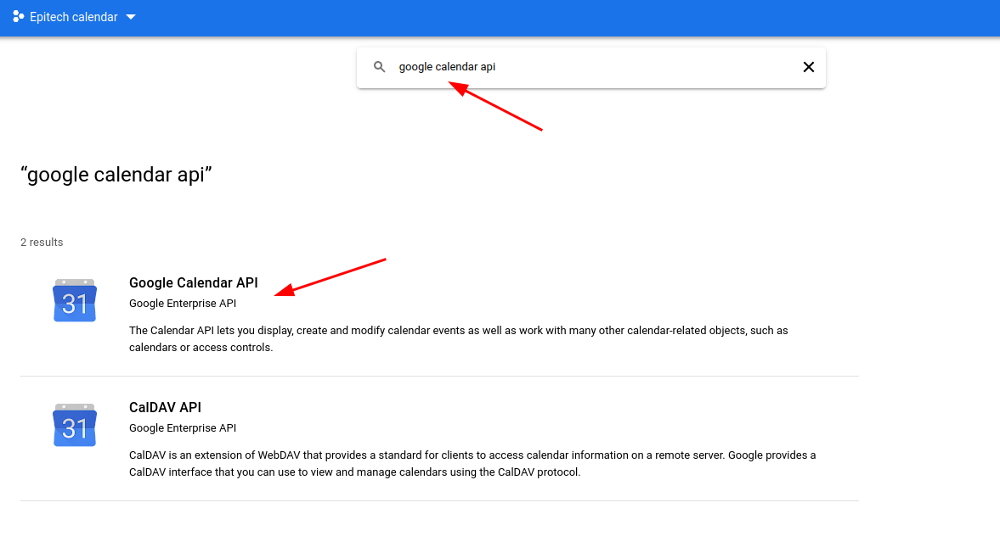
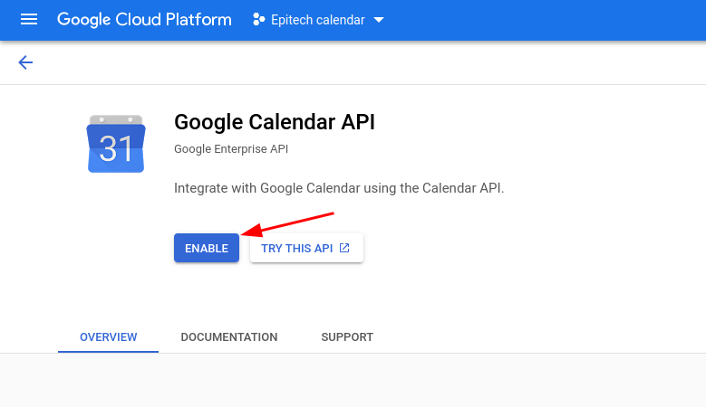
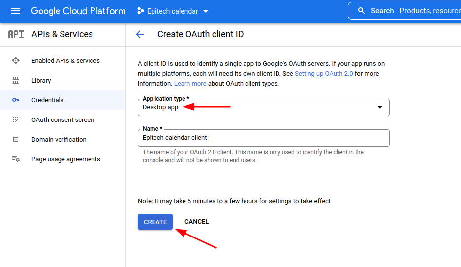

# How generate `credentials.json`

First of all, go to [Google Cloud Console](https://console.cloud.google.com/) and create a new project.

Chose a name for your project and click on `Create` button.

Then, go to `OAuth consent screen`, chose `external` user type and click on `Create` button.

Fill out `Application name`, `User support email` and `Developer email address` and click on `Save and continue` button 3 times and finally click on `Back to dashboard` button.

Then, we need to allow `Google Calendar API` to access your google account. Select `Library` tab.

Search for `Google Calendar API` and select it.

After that, click on `Enable` button.

Now, you can generate your `credentials.json` file. Select `Credentials` tab and click on `Create credentials` button and choose `OAuth client ID`.

Select `Desktop app` as `Application type`, fill out `Application name` and click on `Create` button.

Then, download your generated credentials file.

