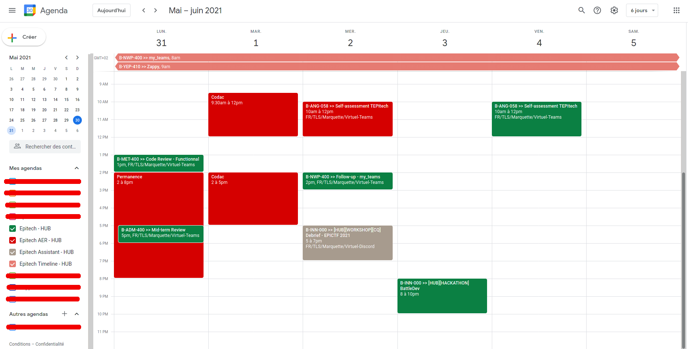

# EPITECH_to_GOOGLE_calendar

Synchronize your Epitech calendar with Google!

# Features

  - [x] Synchronization of epitech calendar on google calendar
  - [x] Update modified events / Remove canceled events
  - [x] Display location and link of event and mails of teaching assistants in google event description
  - [x] Display only the selected slot for multi-slots events
  - [x] Project timeline
  - [x] Fetch events the events which you supervise (HUB acti for example)
  - [x] Fetch registered events from private epitech calendars
  - [x] Support multi epitech accounts (great for AERs who have two epitech accounts and calendars)

# Example

This is my google calendar:
 - In green: registered events from my epitech calendar
 - In light pink: registered project timeline
 - In grey: events that I supervise (often HUB activities)
 - In red: registered events from my AER epitech calendar



# Usage

### Fetch all next events

```
$ python3 main.py
```

### Fetch all events since date

```
$ python3 main.py YYYY-MM-DD
```

# Config

## Python3 - Requirements

```
$ sudo python3 -m pip install -r requirements.txt
```

## Config file

Create a `config.json` file (from `config-sample.json`) with the following content at root of the repo:

```json
[
    {
        "comment": "student / aer ...",
        "epitech_autologin": "auth-...",
        "calendarID_events": "...@group.calendar.google.com",
        "calendarID_timeline": "...@group.calendar.google.com",
        "calendarID_teaching_team": "...@group.calendar.google.com",
        "calendarID_other_calendars": "...@group.calendar.google.com"
    }
]
```

 - `comment` is what you want, it doesn't matter, it's just useful not to get mixed up if you have multiple accounts
 - `epitech_autologin` is your epitech autologin, you can find it on https://intra.epitech.eu/admin/autolog (copy only `auth-...` part)
 - `calendarID_events` is the calendar in which you want to put all registered events
 - `calendarID_timeline` is the calendar in which you want to put projects timeline
 - `calendarID_teaching_team` is the calendar in which you want to put events which you supervise (HUB activities for example)
 - `calendarID_other_calendars` is the calendar in which you want to put events registered in your private epitech calendars

If you don't want some events you can delete line in `config.json` or set value to `null`.
If you want to put all events in only one calendarID you can by using the same calendarID.

### Multi epitech account or fiend account? So easy!

```json
[
    {
        "comment": "student",
        "epitech_autologin": "auth-...",
        "calendarID_events": "...@group.calendar.google.com",
        "calendarID_timeline": "...@group.calendar.google.com",
        "calendarID_teaching_team": "...@group.calendar.google.com",
        "calendarID_other_calendars": "...@group.calendar.google.com"
    },
    {
        "comment": "aer",
        "epitech_autologin": "auth-...",
        "calendarID_events": "...@group.calendar.google.com",
        "calendarID_timeline": "...@group.calendar.google.com",
        "calendarID_teaching_team": "...@group.calendar.google.com",
        "calendarID_other_calendars": "...@group.calendar.google.com"
    }
]
```

## How to get calendarID?

 - Create a calendar in google
 - Go in your new calendar's settings
 - Go in `Integrate Calendar` section
 - Copy `Calendar ID` (in general it looks like `...@group.calendar.google.com`)

## Google `credentials.json`

To connect your google account with this application, you also need to create an OAuth credentials file ([How generate credentials](Generate_credentials.md)) and copy the final `credentials.json` at the root of the repository

# Automatization

To automatize the synchronization with yours epitech calendars, you can use a cron

For example, to run the program every half hour, you can copy this in your crontab (`crontab -e`):

```
*/30 * * * * cd /full/path/EPITECH_to_GOOGLE_calendar/; python3 main.py &>> log
```
